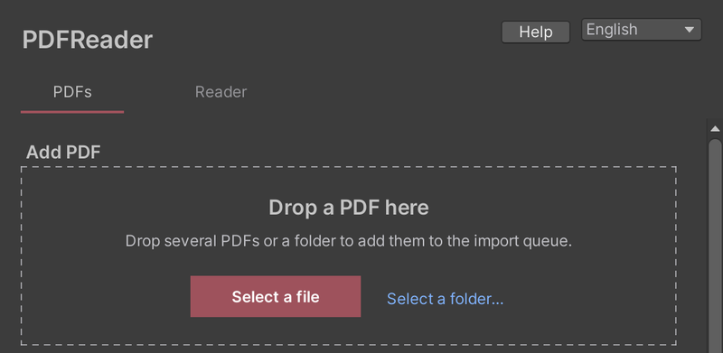
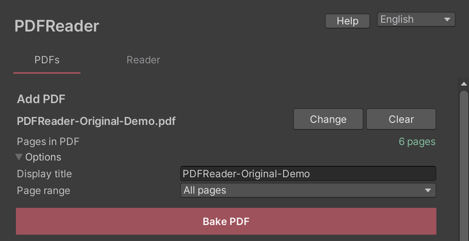

# Adding PDFs

**Tools > PDF Reader** opens on the **PDFs** tab.

1. Drag a PDF into the window, or click **Select a file**.
2. Click **Bake PDF**. Progress is shown, and you can cancel at any time.
3. When baking finishes, the PDF is added to your world. If the scene has no reader, one is placed automatically.

Under **Options** you can change the title shown in the library (the file name by default) and the page range to bake.

## Baking several PDFs

Drop several PDFs or a folder to add them to the import queue. You can also use **Select a folder…**. Everything in the queue can be baked in one go.

## Managing documents

The **Documents** section of the PDFs tab lists the PDFs in your world.

- **Replace**: update the document from another PDF. References in the world are kept.
- **Remove**: take it out of the world. The baked data stays under **Not in the world**, and **Add** puts it back.
- **Delete** (documents not in the world): delete the baked data. The source PDF is not affected. This cannot be undone.

## When some pages are kept as images

After baking you may see "Some pages were kept as images". Those pages are readable, but their text is less sharp when zoomed in. The log lists the reason for each page.

Do not delete files in `Assets/PDFReader/Generated` or `Shared` by hand. Remove documents from this window instead.
