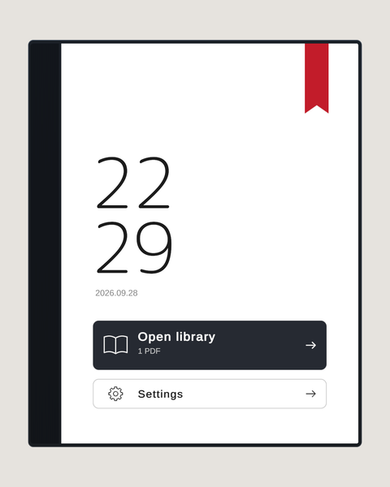
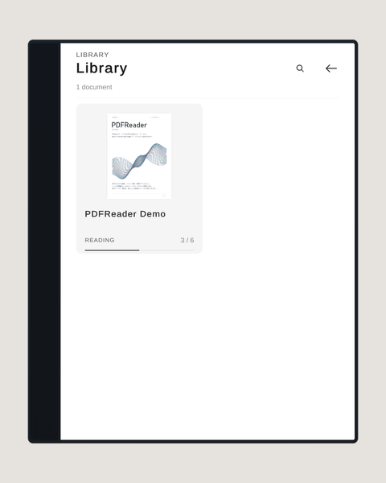
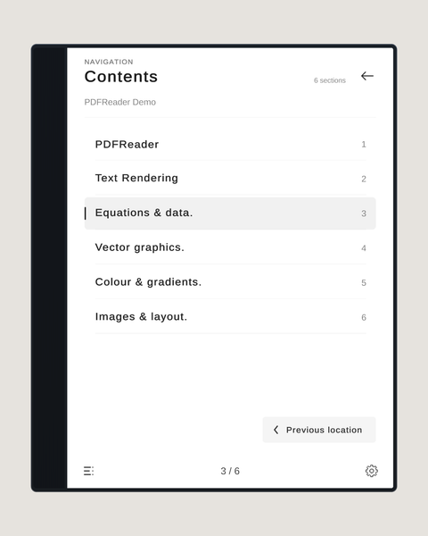
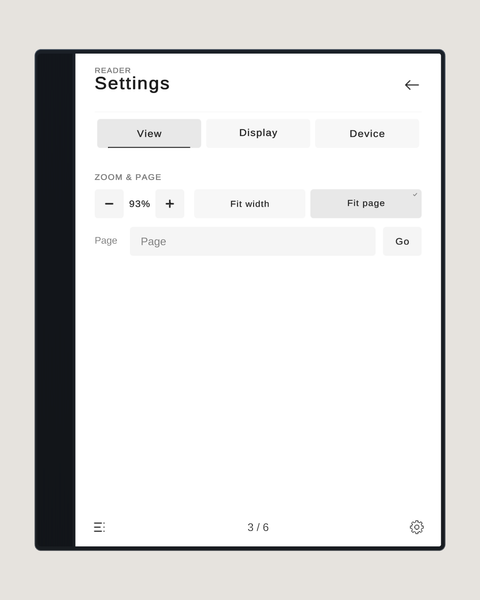
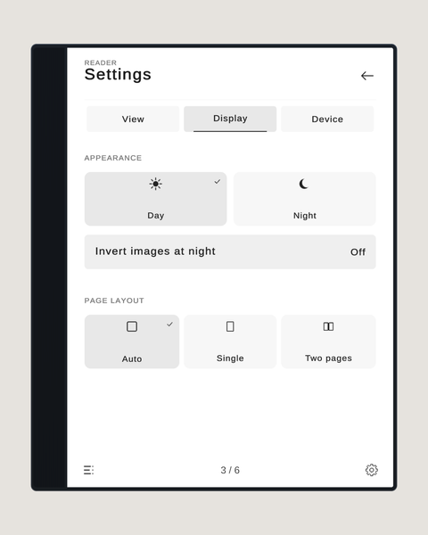
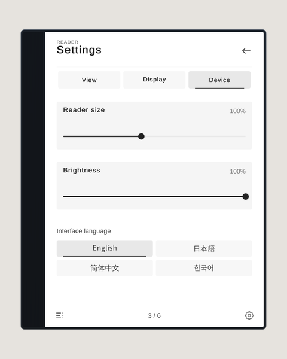

# Using the reader

Use the mouse on desktop and the controller laser in VR. You can pick the reader up and hold it at any angle.

## Home

**Open library** shows your PDFs. If you have a saved position, the red bookmark at the top right resumes it.

## Library

Choose a PDF to open it. The magnifier at the top right searches titles.

## Reading

- Click the left or right edge of the page to turn pages. Hold to keep turning.
- When zoomed in, drag the centre of the page to move around.
- In VR, point at the page and use the right stick to zoom.
- On desktop, Q / E also turn pages while you hold the reader.
- Contents is at the bottom left, Settings at the bottom right, and Back at the top right.

## Contents

Choose a chapter to jump to it. This needs outline data in the source PDF.

## Settings

Settings has three tabs: View, Display and Device.

**View**: zoom, Fit width / Fit page, and go to a page number (only while a PDF is open).

**Display**: Day / Night, invert images at night, and page layout (Auto, Single, Two pages).

**Device**: reader size, brightness and interface language (English, 日本語, 简体中文, 한국어). If a player does not choose a language, it follows their VRChat language. Only the interface is translated; PDF content is shown as it is.

## Sync

The open PDF, page, screen, zoom, position, Day / Night, brightness and reader size are synced to everyone in the instance. The interface language and saved reading positions are kept per player.
