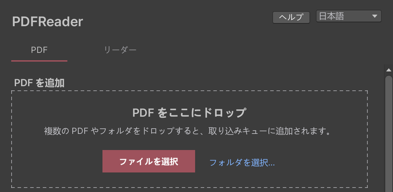
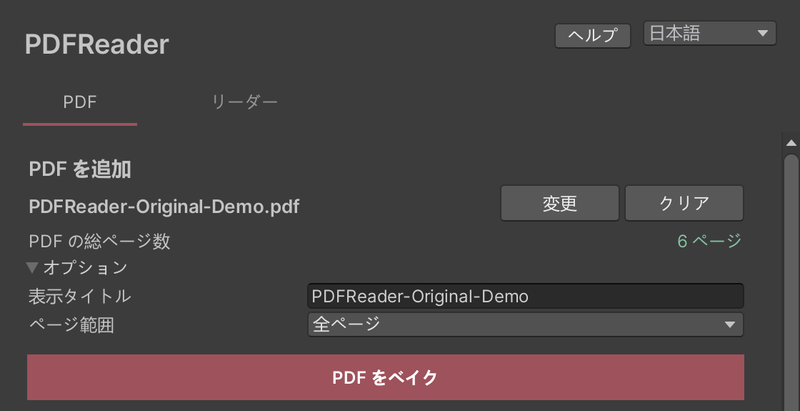

# PDFを追加する

**Tools > PDF Reader** を開くと、「PDF」タブが表示されます。

1. PDFをウィンドウにドラッグ＆ドロップするか、「ファイルを選択」でPDFを選びます。
2. 「PDFをベイク」を押します。進行状況が表示され、途中でキャンセルすることもできます。
3. ベイクが終わると、PDFがワールドに追加されます。シーンにリーダーがない場合は、自動で1台配置されます。

「オプション」では、ライブラリに表示するタイトル（初期値はファイル名）と、ベイクするページ範囲を変更できます。

## 複数のPDFをまとめてベイクする

複数のPDFやフォルダをドロップすると、取り込みキューに追加されます。「フォルダを選択…」からも追加できます。キューの内容は、まとめてベイクできます。

## 追加したPDFを管理する

「PDF」タブの下の「文書」に、ワールドに追加済みのPDFが並びます。

- **置き換え**：別のPDFで内容を更新します。ワールド内の参照はそのまま保たれます。
- **削除**：ワールドから外します。ベイク済みのデータは「ワールド未追加」に残り、「追加」で戻せます。
- **データ削除**（ワールド未追加の文書）：ベイク済みのデータを削除します。元のPDFには影響しませんが、元に戻すことはできません。

## 一部のページが画像になった場合

ベイク後に「一部のページを画像として保存しました」と表示されることがあります。そのページも読めますが、拡大したときの文字の鮮明さはほかのページより下がります。理由はログに記録されています。

`Assets/PDFReader/Generated` と `Shared` の中のファイルは、手動で削除しないでください。PDFの削除はこのウィンドウから行います。

## アップロード前に表示を確認する

ベイクにかかる時間と描画負荷は、PDFのページ数や内容によって変わります。

特殊なPDFでは、表示が元のPDFと異なる場合があります。ワールドをアップロードする前に、追加したPDFの表示を確認してください。表示が異なる場合は、[よくある質問](faq.html)をご覧ください。
