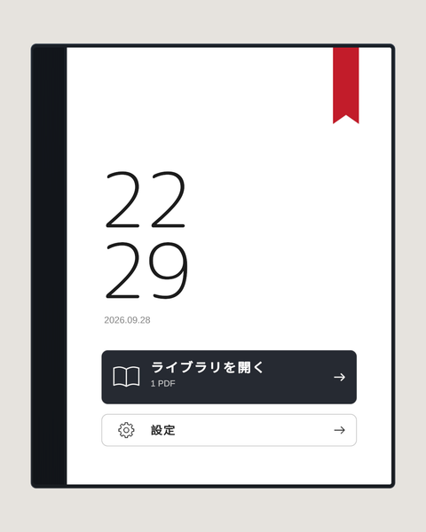
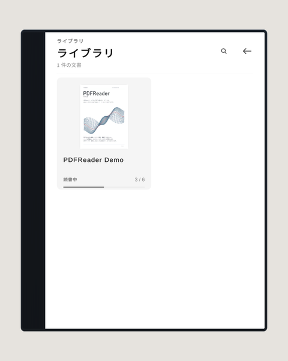
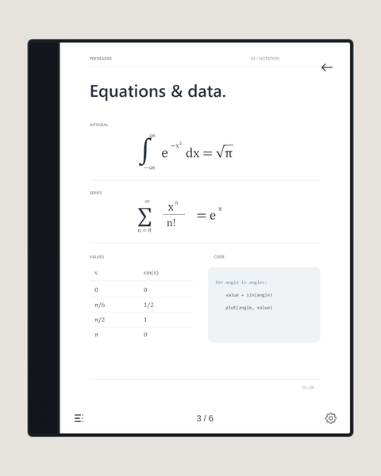
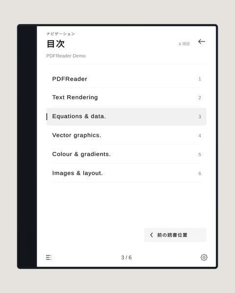
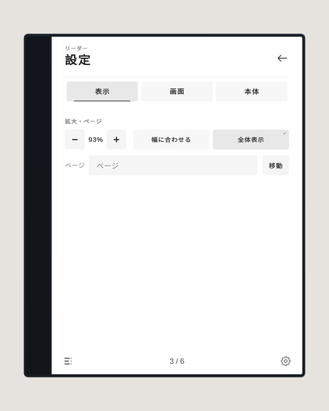
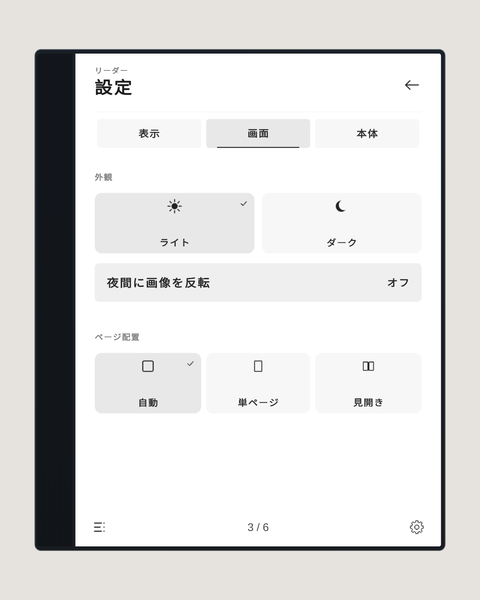
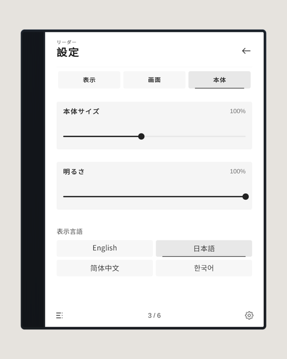

# ワールドでの操作

PCデスクトップではマウス、VRではコントローラーのレーザーで操作します。リーダーは手に持って好きな角度で読めます。

## ホーム

「ライブラリを開く」でPDFの一覧を開きます。前回の続きがある場合は、右上の赤いしおりから再開できます。

## ライブラリ

読みたいPDFを選びます。右上の虫めがねでタイトルを検索できます。

## 読書画面

- ページの左右の端をクリックするとページを送ります。長押しで連続して送ります。
- 拡大しているときは、ページの中央をドラッグして表示位置を動かせます。
- VRでは、本文を指して右スティックで拡大・縮小します。
- PCで本体を持っているときは、Q / E キーでもページを送れます。
- 左下が目次、右下が設定、右上が戻るボタンです。

## 目次

章を選ぶと、そのページに移動します。元のPDFに目次データがある場合に使えます。

## 設定

設定には「表示」「画面」「本体」の3つのタブがあります。

「表示」：拡大率、幅に合わせる／全体表示、ページ番号を指定して移動（PDFを開いているときのみ）

「画面」：ライト／ダーク、夜間に画像を反転、ページ配置（自動・単ページ・見開き）

「本体」：本体サイズ、明るさ、表示言語（English・日本語・简体中文・한국어）。表示言語を選ばない場合は、VRChatの言語設定に合わせて自動で選ばれます。翻訳されるのは操作画面だけで、PDFの内容はそのまま表示されます。

## 同期について

表示中のPDF、ページ、画面、拡大率、表示位置、ライト／ダーク、明るさ、本体サイズは、同じインスタンスのプレイヤー全員に同期されます。表示言語と読書位置の記録は、プレイヤーごとに保存されます。
