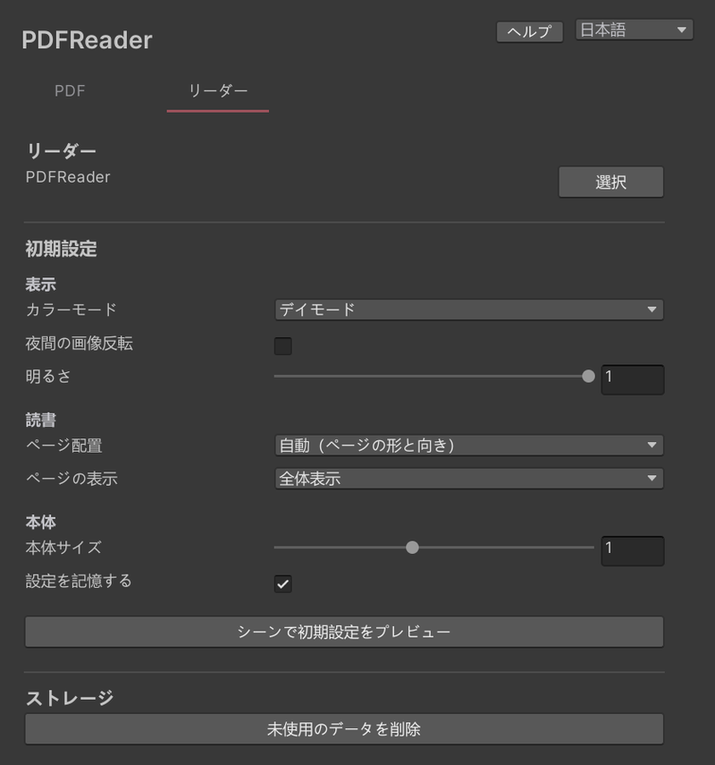

# リーダーの初期設定

「リーダー」タブで、プレイヤーがワールドに入ったときの表示を決めます。

- **カラーモード**：デイモードまたはナイトモード
- **夜間の画像反転**：ナイトモードで画像の色も反転するかどうか
- **明るさ**
- **ページ配置**：自動（ページの形と向き）、単ページ、見開き
- **ページの表示**：幅に合わせる、全体表示
- **本体サイズ**
- **設定を記憶する**：プレイヤーが変えた設定を次回も使うかどうか

「シーンで初期設定をプレビュー」を押すと、シーン上のリーダーに設定が反映されます。

## ストレージ

「未使用のデータを削除」は、どの文書からも使われなくなった共有データを削除します。追加済みのPDFはそのまま残ります。

アップロードされるのは、ワールドに追加したPDFと、その中で使われている文字だけです。使わないPDFは「PDF」タブで削除しておくと、ワールドのサイズを抑えられます。
