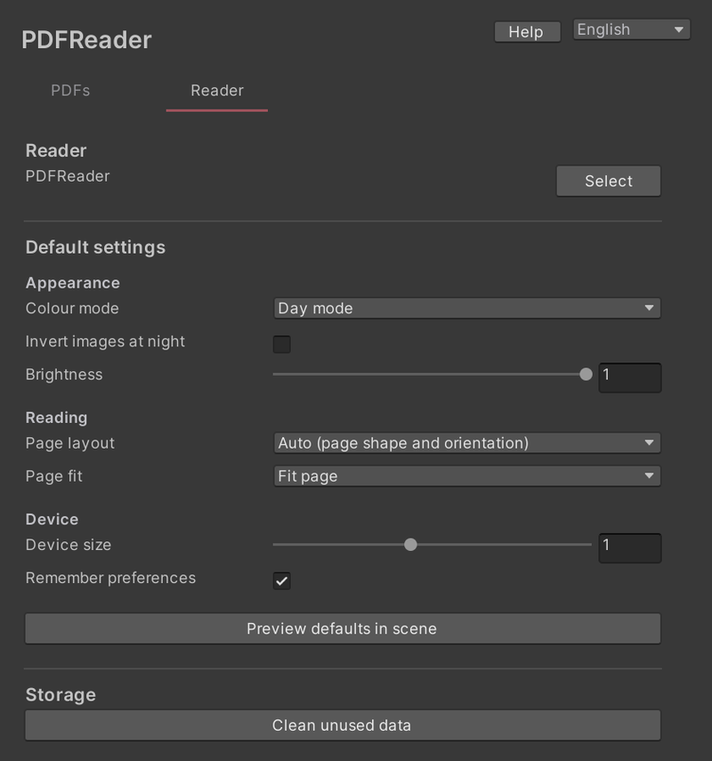

# 리더 기본 설정

리더 탭에서 플레이어가 월드에 들어왔을 때의 표시를 정합니다.

- **색상 모드**: 주간 모드 또는 야간 모드
- **야간 이미지 반전**: 야간 모드에서 이미지 색도 반전할지 여부
- **밝기**
- **페이지 배치**: 자동(페이지 모양과 방향), 한 페이지, 두 페이지
- **페이지 맞춤**: 너비 맞춤, 페이지 맞춤
- **기기 크기**
- **사용자 설정 기억**: 플레이어가 바꾼 설정을 다음에도 사용할지 여부

**씬에서 기본 설정 미리 보기**를 누르면 씬의 리더에 설정이 반영됩니다.

## 저장 공간

**사용하지 않는 데이터 정리**는 어떤 문서에서도 더 이상 쓰지 않는 공유 데이터를 삭제합니다. 추가한 PDF는 그대로 남습니다.

업로드되는 것은 월드에 추가한 PDF와 그 안에서 쓰인 글자뿐입니다. 필요 없는 PDF를 PDF 탭에서 제거해 두면 월드 크기를 줄일 수 있습니다.
